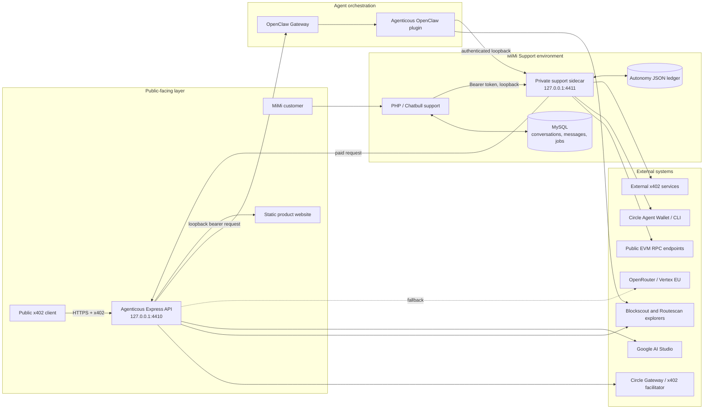
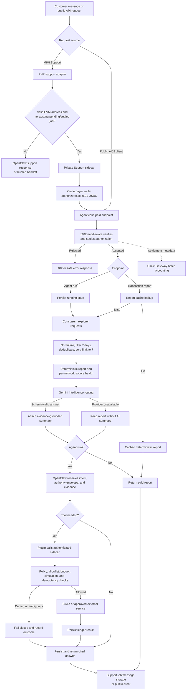
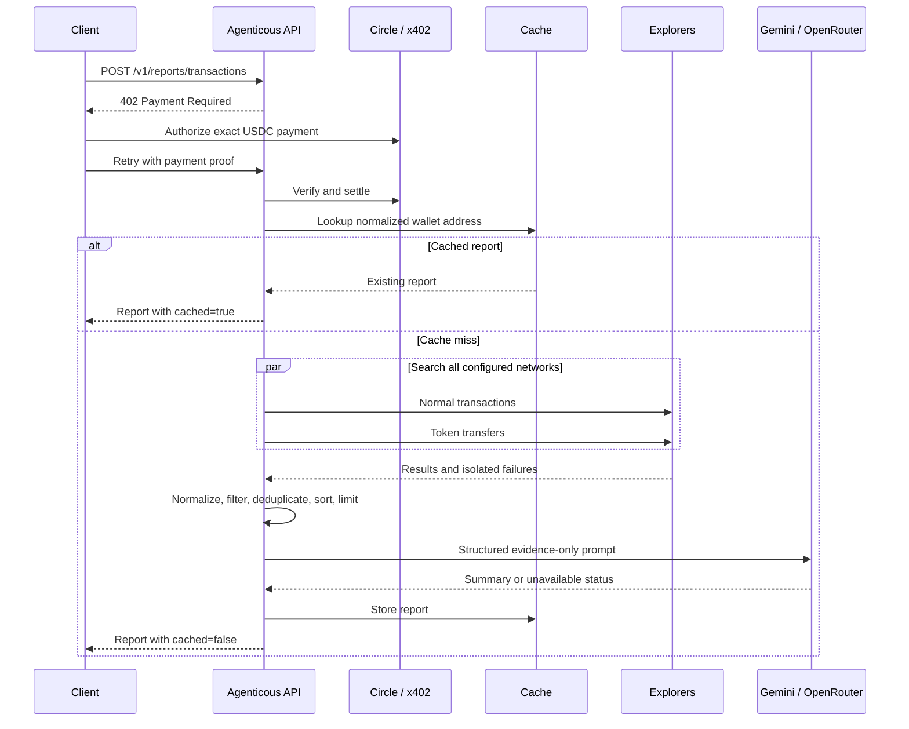
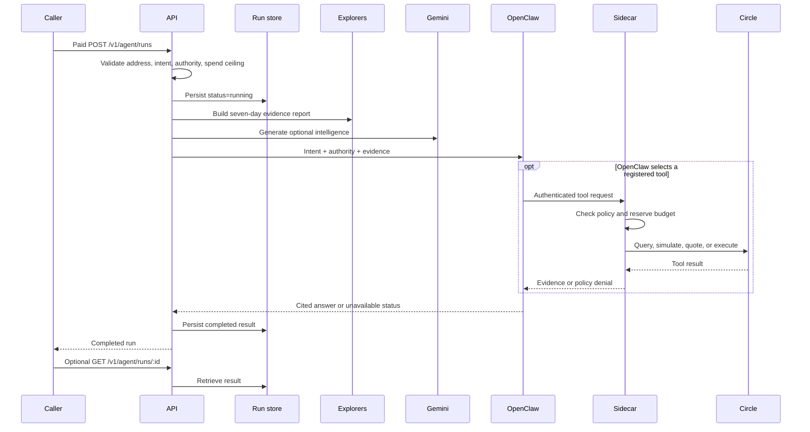
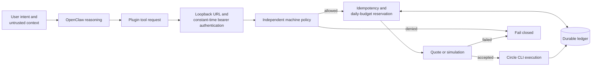

# Agenticous AI agent

Agenticous is a paid, evidence-backed blockchain support and operations service for MiMi Money and public x402 clients. It accepts a public EVM wallet address, gathers recent activity from supported blockchain explorers, normalizes the evidence, optionally explains it with Gemini, and can ask OpenClaw to investigate or carry out independently policy-controlled operations.

A valid public request costs `$0.01` in USDC on Base. Payment is settled to the Agenticous seller wallet through Circle Gateway Nanopayments, with the MiMi facilitator retained as a vanilla-x402 fallback.

Agenticous is an explorer and RPC aggregator rather than a blockchain node or indexer. Explorer evidence is observational, can be delayed or incomplete, and is returned with source-health information and auditable transaction links.

## Deployed wallets

| Role | Base wallet |
|---|---|
| Agenticous receiving wallet | [`0xab959fbf16fb3c1ddfe140c0eac604b2efeae312`](https://basescan.org/address/0xab959fbf16fb3c1ddfe140c0eac604b2efeae312) |
| MiMi Support payer wallet | [`0xa59165d634b3e232abc6affa4c59632604517214`](https://basescan.org/address/0xa59165d634b3e232abc6affa4c59632604517214) |

The Support payer wallet authorizes the x402 USDC payment. The Agenticous receiving wallet is the configured seller and settlement recipient. These are public addresses only; wallet credentials and Circle sessions remain outside the public service.

## What is in this repository

The system has three cooperating TypeScript components and one PHP integration:

1. **Public Agenticous API and website** (`src/`, `public/`): exposes paid reports and agent runs, collects explorer evidence, invokes Gemini and OpenClaw, and stores run results.
2. **Private MiMi Support sidecar** (`integration/support-client/`): owns payment and autonomous-operation policy, communicates with Circle Agent Wallet tooling, queries RPC endpoints, and maintains the spend/idempotency ledger.
3. **OpenClaw plugin** (`integration/openclaw-plugin/`): registers read-only and optional money-moving blockchain tools. Sensitive operations are delegated to the sidecar rather than executed in the plugin.
4. **MiMi Support adapter** (`integration/support/`): connects the service to the PHP/CodeIgniter Chatbull support application and records conversations, jobs, and settlement metadata in MySQL.

## Features

| Capability | What it provides | Primary component |
|---|---|---|
| Paid blockchain reports | `$0.01` x402-protected, seven-day EVM wallet activity reports | Agenticous API |
| Multichain evidence | Concurrent native-transaction and token-transfer searches across ten configured networks | Explorer pipeline |
| Resilient aggregation | Per-provider timeouts, partial-result reporting, normalization, deduplication, and explorer links | Explorer pipeline |
| AI explanations | Schema-validated Gemini summaries with Google AI Studio first and OpenRouter fallback | Intelligence router |
| Agent investigations | Natural-language investigations grounded in the same deterministic explorer report | OpenClaw Gateway |
| Bounded autonomy | Read-only, proposal, and autonomous authority modes with an explicit spend ceiling | API, OpenClaw plugin, sidecar |
| Machine-enforced payments | Circle Gateway Nanopayments plus independent recipient, network, amount, budget, and idempotency checks | x402 middleware and sidecar |
| Support automation | EVM-address detection, one-report-per-conversation behavior, durable job tracking, and human handoff | MiMi Support adapter |
| Recovery and observability | Persisted agent runs, interrupted-run recovery, request IDs, health/capability endpoints, and sanitized settlement logs | API and run store |
| Secure deployment | Loopback-only privileged services, bearer authentication, bounded request bodies, rate limiting, and hardened systemd units | Deployment layer |

Agenticous is not a single unrestricted model with custody of a wallet. It is an agentic service system: OpenClaw can select tools and pursue an authorized intent, while deterministic code controls evidence collection, payment settlement, wallet access, spend limits, and persistence. This separation lets autonomous runs operate inside a narrow, auditable security boundary.

### Evidence-backed transaction reports

The report service searches Ethereum, Polygon, MegaETH, Base, Base Sepolia, Mezo, Arbitrum One, Arbitrum Sepolia, Celo, and Avalanche C-Chain.

For every configured explorer it fetches normal transactions and token transfers concurrently. It then:

- keeps activity from the previous seven days;
- normalizes native and token records into a common schema;
- classifies activity as `in`, `out`, `self`, or `contract`;
- deduplicates records by network and transaction hash;
- sorts all networks newest-first and returns at most seven transactions;
- identifies unavailable or partially available explorer feeds; and
- preserves explorer links for independent verification.

Explorer calls use bounded timeouts and `Promise.allSettled`, so one failing network does not fail the complete report.

### Tiered Gemini intelligence

Google AI Studio is the primary intelligence provider. OpenRouter is the fallback and is strictly pinned to `google-vertex/eu` with provider fallback disabled.

The routing order is:

| Workload | Provider and model order |
|---|---|
| Light | Google Gemini 2.5 Flash-Lite → OpenRouter Gemini 2.5 Flash-Lite → Google Gemini 3.5 Flash → OpenRouter Gemini 3.5 Flash |
| Intensive | Google Gemini 3.5 Flash → OpenRouter Gemini 3.5 Flash |

Automatic routing treats reports with four or more returned transactions as intensive. The model receives only normalized evidence and must return a schema-validated overview plus at most three notable observations. It is instructed not to infer identity, wallet ownership, intent, fraud, risk, or missing activity.

If every AI attempt fails or no API key is configured, Agenticous still returns the deterministic explorer report.

### OpenClaw investigations and operations

Agent runs combine a wallet address, a natural-language intent, and an authority envelope:

- `read-only`: investigate using evidence and read-only tools;
- `propose`: investigate and describe a possible operation without executing it; or
- `autonomous`: allow OpenClaw to request enabled money-moving tools within the declared external-spend ceiling.

The OpenClaw plugin provides tools for:

- recent multichain wallet activity;
- native and ERC-20 balances;
- allowances, transaction receipts, finality, and contract queries;
- Circle wallet status, balances, history, and budget;
- USDC transfers;
- Circle x402 service discovery and purchase; and
- transfers, swaps, bridges, and contract execution.

There is no public unauthenticated transfer endpoint. Autonomous execution is indirect: the public service sends the authority envelope to OpenClaw, OpenClaw invokes a registered plugin tool, and the plugin calls the loopback-only sidecar. The sidecar remains the final security boundary and can reject every operation independently of the model.

### MiMi Support integration

The PHP adapter creates or resumes a Chatbull conversation, saves messages, and detects EVM addresses in customer text. When it finds an address and the conversation has no existing pending or settled Agenticous job, it asks the sidecar to buy a report and records the result and payment metadata.

Messages without a new report request are sent to OpenClaw for ordinary support assistance. When either service cannot return a verified result, the conversation is placed into human handoff rather than claiming success.

## Public API

| Method | Endpoint | Payment | Purpose |
|---|---|---:|---|
| `GET` | `/` | No | Static product website |
| `GET` | `/healthz` | No | Liveness and provider configuration |
| `GET` | `/v1/capabilities` | No | Pricing, wallet, networks, models, and authority discovery |
| `POST` | `/v1/reports/transactions` | Yes | Seven-day transaction report |
| `POST` | `/v1/agent/runs` | Yes | Evidence-backed OpenClaw investigation or operation |
| `GET` | `/v1/agent/runs/:id` | No | Retrieve a stored run by UUID |

### Transaction report request

```json
{
  "address": "0x0000000000000000000000000000000000000001"
}
```

### Agent run request

```json
{
  "address": "0x0000000000000000000000000000000000000001",
  "intent": "Investigate the recent failed transaction and explain what is known.",
  "authority": {
    "mode": "read-only",
    "maximumExternalSpendUsd": "0"
  }
}
```

An unpaid POST returns HTTP `402` with standard x402 payment requirements. The Support sidecar can authorize the exact payment with its dedicated payer wallet and retry automatically. Payment middleware runs before the report cache, so a cache hit remains a paid request.

Agent-run POSTs save a `running` record before execution, but currently wait synchronously for explorer, AI, and OpenClaw processing before responding. `GET /v1/agent/runs/:id` supports later retrieval, and persisted `running` jobs are resumed when the service restarts.

## System architecture diagram



The public API never receives buyer wallet credentials. Payment authorization remains with the x402 client or the private Support sidecar; privileged actions requested by OpenClaw are re-authorized against sidecar policy before Circle tooling can execute them.

## End-to-end data flow diagram



The main data path is deterministic through evidence normalization. Gemini adds an explanation but cannot alter the underlying transaction records. OpenClaw enters the path only for agent runs or ordinary Support assistance, and every privileged tool request crosses the sidecar policy boundary.

## Paid report data flow



## Agent-run data flow



## Autonomous-action security boundary

OpenClaw decides which tool to request, but it does not decide whether a sensitive action is permitted. That decision belongs to the private sidecar.



The sidecar enforces:

- explicit enablement for transfers, general actions, and x402 purchases;
- exact decimal amounts and per-action maximums;
- a rolling 24-hour aggregate spend limit;
- chain, recipient, contract, and external-host policies;
- HTTPS and public-network rules for external purchases;
- quotes or simulations before supported operations;
- durable 8–128 character idempotency keys; and
- zero native value for autonomous contract execution.

The ledger reserves budget before execution. Completed requests with the same key return the recorded result; conflicting, already-reserved, failed, or ambiguous requests are not replayed automatically.

## Data and persistence

| Data | Storage | Behavior |
|---|---|---|
| Transaction reports | In-memory `Map` | Case-insensitive address key, configurable TTL, maximum 500 entries, lost on restart |
| Agent runs | In-memory `Map`, optionally JSON | Maximum 1,000 entries; serialized writes and atomic file replacement |
| Autonomous actions | JSON ledger | Serialized execution; last 5,000 entries persisted and last 500 exposed by status |
| Support conversations and messages | MySQL / Chatbull tables | Durable conversation history and handoff state |
| Paid report jobs | `mimi_agenticous_jobs` | Durable job and settlement metadata |
| Wallet authority | Circle session or sidecar environment | Never exposed to the public service |

Run and ledger files are written through a temporary file and atomic rename with mode `0600`.

## Operational and safety properties

- Only public EVM addresses are accepted; seed phrases and private keys are never request fields.
- The seller private key is not required by the public service; it stores only the receiving address.
- The Support payer credential or Circle session is isolated in the private sidecar environment.
- Public and sidecar JSON bodies are limited to 16 KB and 8 KB respectively.
- APIs are rate-limited and protected with Helmet security headers.
- External calls have bounded timeouts and independent failure handling.
- OpenClaw and sidecar URLs must resolve to loopback HTTP endpoints.
- The sidecar compares its internal bearer token in constant time.
- Local-key x402 payments must exactly match scheme, network, amount, and recipient policy.
- Circle commands use `execFile` argument arrays rather than a shell command string.
- RPC overrides require HTTPS.
- Model responses are schema validated and cannot replace deterministic evidence.
- Autonomous actions fail closed unless every policy check passes.
- Hardened systemd services run without privileges, capabilities, home access, or writable system paths.

## Implementation notes

- OpenClaw unavailability normally leaves the explorer report usable; the run records orchestration as unavailable instead of discarding evidence.
- The product-page “30-second decision loop” is a timer-driven visualization backed by `/healthz`, not a stream of live backend execution events.
- The main report pipeline covers ten networks. The plugin's direct explorer tool covers nine and omits Avalanche; the sidecar's direct RPC allowlist is smaller again.
- The plugin's direct wallet-activity tool reads normal Blockscout transactions and is intentionally simpler than the public report pipeline, which also normalizes token transfers.
- A MiMi Support conversation does not purchase another report after it has an existing `pending` or `settled` Agenticous job.
- Run retrieval uses an unguessable UUID rather than caller authentication.
- Paid routes advertise a 30-day Gateway authorization window because Circle CLI 1.0.0 raises batched payment requirements to that value before signing. Keeping the seller and CLI requirements identical prevents a proof from verifying successfully and then failing during settlement.
- Circle verify and settle lifecycle logs contain only outcome, reason, network, amount, timeout, and transaction identifier; signed authorization payloads are never logged.

## Circle Agent Wallet setup

The code supports Circle Agent Stack without storing its MPC key shares. Wallet provisioning requires the operator's explicit Circle terms acceptance and email OTP, so it is intentionally not fabricated by the deployment scripts:

```sh
npm install -g @circle-fin/cli
sudo -u mimi-support-x402 env HOME=/var/lib/mimi-support-x402 circle wallet login support@example.com
sudo -u mimi-support-x402 env HOME=/var/lib/mimi-support-x402 circle wallet list --type agent --chain BASE
sudo -u mimi-support-x402 env HOME=/var/lib/mimi-support-x402 circle gateway deposit --amount 5 --address 0xa59165d634b3e232abc6affa4c59632604517214 --chain BASE --method direct
```

Circle CLI requires Node.js 20.18.2 or newer. Authenticate as the sidecar service account because Circle sessions are stored per user and expire after seven days. Deploy with `CIRCLE_AGENT_WALLET_ADDRESS=0xa59165d634b3e232abc6affa4c59632604517214` and `CIRCLE_AGENTICOUS_WALLET_ADDRESS=0xab959fbf16fb3c1ddfe140c0eac604b2efeae312`.

The sidecar pays from the Support wallet with `circle services pay --max-amount 0.01`; Agenticous receives into its seller wallet. If the Circle variables are absent, tightly scoped local wallets remain available for migration and testing. Both public addresses are linked to Basescan by capability and support responses.

After reviewing and accepting Circle's terms, complete the one-time OTP login and create Circle-native limits. These are provisioning actions, not per-transaction approvals:

```sh
sudo -u mimi-support-x402 env HOME=/var/lib/mimi-support-x402 CIRCLE_ACCEPT_TERMS=1 circle wallet login support@example.com
sudo -u mimi-support-x402 env HOME=/var/lib/mimi-support-x402 CIRCLE_ACCEPT_TERMS=1 circle wallet limit set --address 0xa59165d634b3e232abc6affa4c59632604517214 --chain BASE --policy-type stablecoin --per-tx 0.05 --daily 0.25 --weekly 1.00 --monthly 4.00
sudo ./deployment/activate-circle-autonomy.sh 0xa59165d634b3e232abc6affa4c59632604517214
```

The activation script refuses to proceed unless the Circle session and wallet budget are available. It backs up the sidecar environment, switches from the local migration key to the Circle Agent Wallet, and enables autonomous transfers, actions, and x402 purchases.

Start with bounded recipient, contract, chain, and hostname allowlists. The `any` and `public-internet` modes remain protected by budgets and SSRF checks, but intentionally expand risk.

## Set up locally from GitHub

### Prerequisites

- Git
- Node.js 18.18 or newer (Node.js 20 or 22 LTS is recommended)
- npm, included with Node.js

Clone the repository and enter the project directory:

```sh
git clone https://github.com/<your-account>/<repository>.git
cd <repository>
```

Install the exact dependency versions from `package-lock.json` and create a local configuration file:

```sh
npm ci
cp .env.example .env
```

Edit `.env` and configure at least `SELLER_ADDRESS`. Add `GEMINI_API_KEY` and/or `OPENROUTER_API_KEY` to enable generated summaries. Never commit `.env`; it is intentionally ignored by Git.

Verify and build the public service:

```sh
npm run typecheck
npm test
npm run build
```

Start the service:

```sh
npm start
```

By default, open `http://127.0.0.1:3000` (or the `HOST` and `PORT` configured in `.env`). The service creates runtime state only when `AGENT_RUN_STORE_PATH` is configured; database and runtime data are not included in this repository.

### Optional integrations

A complete mainnet payment requires the Support payer wallet to hold or deposit Base USDC into Circle Gateway.

Verify the private support sidecar:

```sh
cd integration/support-client
npm ci
cp .env.example .env
npm run typecheck
npm test
npm run build
npm start
```

Build and test the OpenClaw plugin with OpenClaw's supported Node runtime:

```sh
cd integration/openclaw-plugin
npm ci
npm run build
npm test
```

Use `deployment/install-openclaw-plugin.sh` to stage and configure the plugin. The installer deliberately does not restart the live OpenClaw Gateway. Configure the Circle Agent Wallet and Circle-native spending policy before enabling `AUTONOMOUS_ACTIONS_ENABLED`, `AUTONOMOUS_TRANSFERS_ENABLED`, or `X402_PURCHASES_ENABLED`.

The schema-only migration at `integration/support/mimi-agenticous-jobs.sql` creates the optional support job table. It contains no production records. Apply it only to a database you control and only when installing the PHP/CodeIgniter support integration.
