# MiMi Money

<div align="center">
AI Agent powered Super app, Blockchain Wallet and Web3/Web4 Gateway for Humans and AI agents.


AI Agent powered Super app, Blockchain Wallet and Web3 (Web2+Blockchain)/Web4 (Web3+AI) Gateway to Transact, Social and Business network.

Free Chat, Voice and Video calls in real-time by registering with a free Wallet address to Transact, Social and Business network.

AI-powered financial infrastructure for communication, self-custody, peer-to-peer markets, support, and autonomous blockchain operations.

[Website](https://mimi.money) · [P2P market](https://peers.mimi.money) · [AI support](https://support.mimi.money) · [Agenticous](https://agenticous.mimi.money) · [x402 facilitator](https://x402.mimi.money) · [Geto Space](https://geto.space)

</div>

<p align="center">
  <a href="https://www.youtube.com/watch?v=1aNq5SephaU" title="Watch the MiMi Money product demo on YouTube">
    
  </a>
</p>

MiMi Money is a mobile-first financial and communications platform built for people and businesses that need one place to communicate, hold and move digital assets, discover services, trade peer to peer, and receive intelligent support. It combines a native Android application, a PHP/MySQL messaging API, a Socket.IO realtime layer, a P2P trading application, an AI customer-support surface, an evidence-backed blockchain operations agent, and a self-hosted x402 payment facilitator.

The system deliberately separates probabilistic AI reasoning from deterministic financial controls. Gemini and OpenClaw can interpret a request, explain verified evidence, and choose tools; ordinary application code remains responsible for authentication, payment verification, wallet policy, spend ceilings, recipient and network allowlists, idempotency, persistence, and safe failure.

> [!IMPORTANT]
> This repository contains source code, schema-only database definitions, public client configuration, deployment templates, and documentation. It does **not** contain production database records, wallet private keys, recovery phrases, Circle sessions, signing keystores, server environment files, Firebase service-account credentials, or live user uploads.

## Contents

- [Why MiMi Money](#why-mimi-money)
- [Product capabilities](#product-capabilities)
- [Experience tour](#experience-tour)
- [AI agents and orchestration](#ai-agents-and-orchestration)
- [System architecture](#system-architecture)
- [End-to-end data flow](#end-to-end-data-flow)
- [Backend services](#backend-services)
- [Google Cloud and Google products](#google-cloud-and-google-products)
- [How it was built and technology stack](#how-it-was-built-and-technology-stack)
- [Repository map](#repository-map)
- [Getting started](#getting-started)
- [Configuration and secrets](#configuration-and-secrets)
- [Build, test, and validation](#build-test-and-validation)
- [Security and reliability model](#security-and-reliability-model)
- [Operations and deployment](#operations-and-deployment)
- [Roadmap](#roadmap)
- [Known boundaries](#known-boundaries)
- [Documentation index](#documentation-index)
- [Contributing](#contributing)
- [License](#license)

## Why MiMi Money

Across many African markets, money movement, communication, identity, customer support, and access to digital work are fragmented across separate applications and incompatible payment rails. A user may need one app to chat with a seller, another to exchange value, another to access a wallet, and yet another to resolve a failed transaction. MiMi Money brings those activities into a connected experience while keeping financial actions bounded by explicit software policy.

<p align="center">
  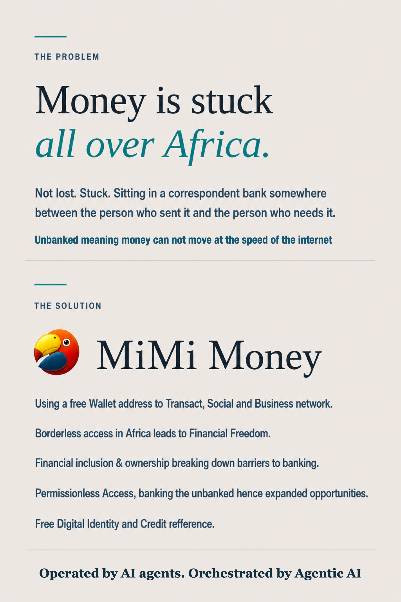
</p>

MiMi Money is designed around five ideas:

1. **Communication is part of a transaction.** Messaging, status, groups, media, voice, and video keep buyers, sellers, support teams, and communities in context.
2. **A wallet should be useful, not isolated.** The Android client includes multichain wallet functions, QR workflows, dApp access, WalletConnect-compatible sessions, and links to MiMi financial services.
3. **AI needs evidence and limits.** Support answers and blockchain investigations are grounded in normalized data, while privileged actions pass through deterministic policy enforcement.
4. **Agents need native payments.** x402 lets software pay for an API call with a signed on-chain authorization instead of relying only on accounts, API keys, or monthly subscriptions.
5. **The platform must degrade safely.** Explorer, model, notification, and telemetry failures are isolated so a partial dependency outage does not become a false claim, uncontrolled payment, or application crash.

## Product capabilities

### Native Android super-app

The Android application is the primary customer surface. Its checked-in implementation includes:

- wallet-address-based registration and authenticated sessions;
- one-to-one and group messaging;
- text, image, audio, video, document, location, and contact sharing;
- delivery, seen, downloaded, and per-user message status;
- online presence, typing state, missed-message synchronization, and local Realm persistence;
- WebRTC voice and video calling with Socket.IO signaling and configurable STUN/TURN;
- profiles, contacts, blocking, groups, admins, statuses, search, and media browsing;
- push notifications through Firebase Cloud Messaging;
- a self-custodial EVM wallet using BIP-39/Web3j primitives;
- Ethereum, BNB Chain, Base, Polygon, Arbitrum, Avalanche, and Celo network definitions;
- native and token balance presentation, sends, QR scanning, transaction signing, and explorer links;
- a dApp browser with WalletConnect/Reown WalletKit request approval;
- direct access to MiMi Bank, MiMi Pay, the P2P marketplace, Geto Space, and support;
- a defensive, cached catalogue for third-party CROO agents and services priced in USDC;
- local/provider-backed Realm backup and restore workflows;
- privacy-sanitized Firebase Analytics, Crashlytics, and Performance telemetry; and
- modern Android build support: API 36.1, target SDK 36, four supported ABIs, and 16 KB page-size-aware native packaging.

### Messaging and realtime communication

The core server stores users, sessions, messages, groups, calls, statuses, media metadata, pending wallet-address deliveries, and delivery receipts in MySQL. The realtime Node.js service adds Socket.IO presence, typing, message events, receipt updates, missed-message recovery, call signaling, and push fallback.

Messages can be addressed to a known user or queued against a wallet address. When that wallet later maps to an account, the backend can resolve the pending messages and materialize recipient delivery state. This allows wallet identity and communication identity to converge without requiring the recipient to have been fully registered at send time.

### Self-custodial wallet and dApps

The mobile wallet creates or restores credentials locally and signs supported EVM transactions on-device. It exposes network-aware RPC and explorer behavior, QR-based address flows, token/NFT views, dApp shortcuts, and WalletConnect sessions. The embedded dApp provider limits exposed methods, requires user approval for requests, and distinguishes connection from transaction authorization.

> [!CAUTION]
> Never put a recovery phrase, private key, signing keystore, wallet password, or production access token in this repository, an issue, a support transcript, analytics, or crash reporting.

### Peer-to-peer trading

The P2P experience is a dependency-free browser application served by a small Node.js gateway. It supports:

- buy and sell advertisements;
- market filters and price/amount entry;
- account registration and login;
- order creation and status tracking;
- buyer/seller order chat;
- payment methods and user profiles;
- P2P wallet balance transfers;
- merchant advertisements;
- reviews, cancellations, disputes, and release flows; and
- gift-card listings and orders.

Browser requests go to the local `/api/*` or `/app/*` gateway. The gateway forwards them to the configured MiMi upstream and injects the server-side API secret, keeping that credential out of frontend JavaScript.

### AI customer support

The support application combines a customer-facing web chat, a PHP/CodeIgniter service, MySQL conversation history, OpenClaw model orchestration, and a human-support handoff path. A customer can also open this surface inside the Android application.

Ordinary support questions are sent to the loopback-only OpenClaw gateway with conversation context. When a message contains an EVM address, the adapter can create a durable Agenticous job, ask the private sidecar to purchase a wallet report, persist payment metadata, and return the evidence-grounded result. A failed or unverifiable result moves to human handoff instead of being presented as success.

### Agenticous blockchain intelligence

Agenticous is a paid blockchain support and operations service. It accepts a public EVM address, collects recent activity from multiple explorers, normalizes and deduplicates the evidence, optionally asks Gemini for a constrained explanation, and can invoke OpenClaw for an investigation or a policy-controlled operation.

Its report pipeline searches the configured Ethereum, Polygon, MegaETH, Base, Base Sepolia, Mezo, Arbitrum One, Arbitrum Sepolia, Celo, and Avalanche C-Chain sources. It queries native transactions and token transfers concurrently, restricts results to the previous seven days, preserves explorer links, reports partial source health, and returns at most seven newest transactions.

Public reports and agent runs are protected by a `$0.01` USDC x402 payment on Base. Circle Gateway Nanopayments is the preferred facilitator path; the MiMi x402 facilitator is retained as the standard x402 fallback.

### Machine-native x402 payments

The MiMi facilitator implements x402 protocol version 2 for EVM networks. It advertises supported schemes, verifies signed payment authorizations, optionally screens requests through a compliance webhook, settles valid authorizations with chain-specific clients, and records deduplicated monthly usage.

It supports `exact` payments for fixed-price resources and `upto` payments for metered or capped usage. The facilitator does not custody arbitrary buyer funds and does not host paid content: the resource server defines its price and the payer signs the authorization.

## Experience tour

### MiMi Money dashboard

<p align="center">
  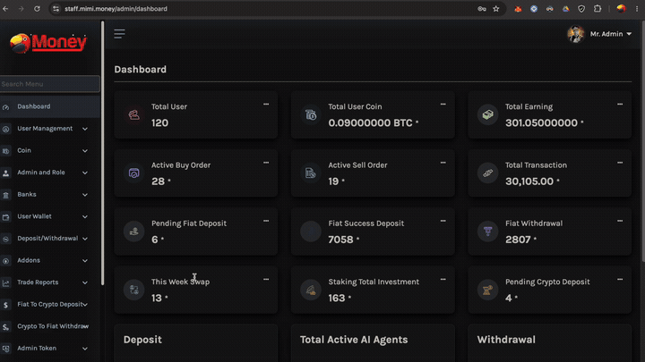
</p>

### Geto Space

Geto Space is linked from the Android experience as the community and ecosystem surface.

<p align="center">
  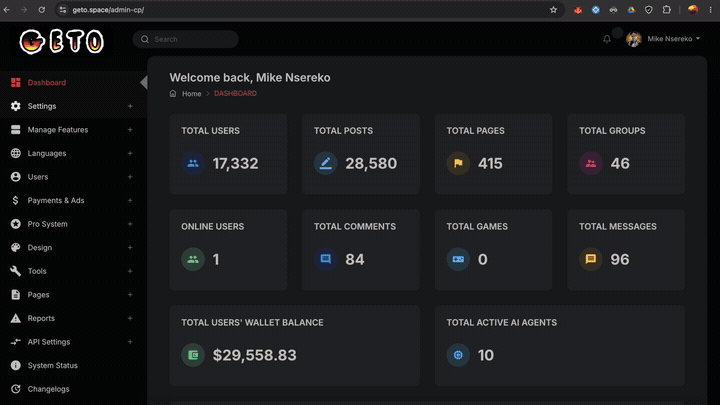
</p>

### Architecture at a glance

<p align="center">
  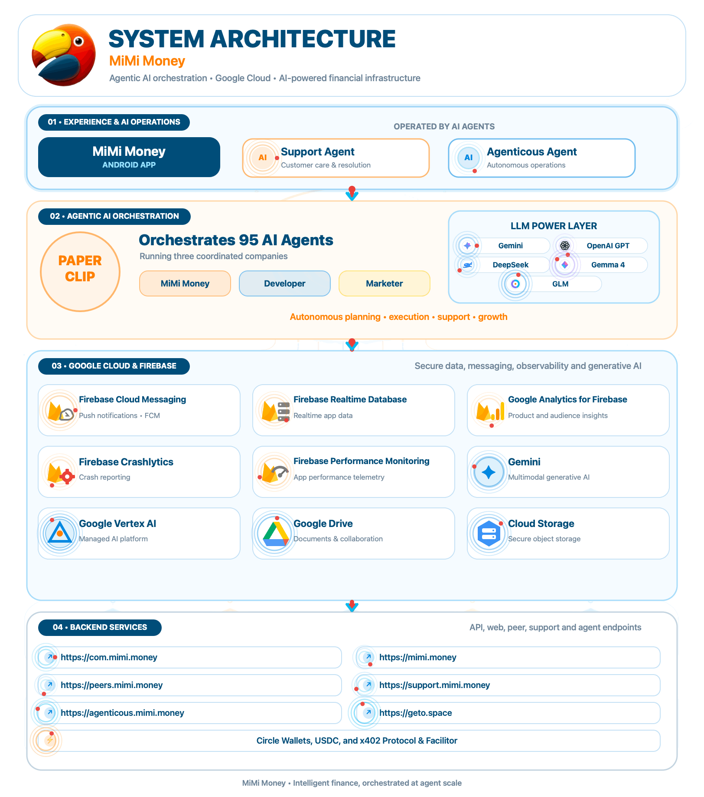
</p>

For a static, zoom-friendly version, see [the system architecture PNG](Assets/MiMi-Money-System-Architecture.png).

## AI agents and orchestration

MiMi Money uses “agent” for several related but deliberately separate capabilities.

| Agent layer | Role | Inputs | Tools/data | Authority boundary | Failure behavior |
|---|---|---|---|---|---|
| **MiMi Support Agent** | Answers customer-support questions and manages conversation flow | Customer message and stored conversation history | OpenClaw gateway, support database, Agenticous adapter | No direct public money-moving endpoint | Persists the request and hands off to a human |
| **Agenticous AI Agent** | Produces evidence-backed wallet reports and pursues blockchain intents | EVM address, intent, authority envelope | Explorers, Gemini, OpenClaw blockchain plugin | `read-only`, `propose`, or bounded `autonomous`; sidecar independently re-authorizes | Returns deterministic evidence without AI, or records a safe denial/error |
| **Agenticous OpenClaw plugin** | Makes blockchain and Circle tools available to the orchestrator | Tool call selected by OpenClaw | Explorer/RPC reads and authenticated sidecar operations | Sensitive actions are delegated to a loopback service, never performed inside the model/plugin alone | Tool error is returned to the run; no success is claimed without evidence |
| **Private support sidecar** | Pays for reports and enforces privileged operation policy | Authenticated loopback request | Circle Agent Wallet tooling, RPC, x402 services, autonomy ledger | Recipient/network/contract allowlists, budgets, simulation, idempotency, exact-price checks | Fails closed and records a bounded outcome |
| **CROO marketplace agents** | Third-party services discoverable from Android | Public catalogue search and detail request | Read-only CROO public catalogue | MiMi parses, bounds, sanitizes, ranks, and caches untrusted metadata | Uses a bounded stale cache or an empty/error state |
| **Paperclip workforce** | Coordinates longer-running company, engineering, and marketing work | Goals, issues, projects, budgets, and agent heartbeats | Configured model/CLI adapters and company workspaces | Organization hierarchy, role scope, budgets, issue assignment, workspace confinement | Run state and work remain observable and resumable |

### Support Agent flow

1. The customer opens `support.mimi.money` directly or through the Android `SupportAgentActivity`.
2. The support API creates or resumes a conversation using a public token.
3. The message and response are persisted in MySQL.
4. If no wallet address needs investigation, the PHP adapter sends bounded conversation history to OpenClaw.
5. If a valid EVM address is present and the conversation does not already have an active Agenticous job, the adapter calls the private report sidecar.
6. The sidecar authorizes the exact x402 payment from the dedicated support payer wallet.
7. Agenticous verifies and settles payment, gathers explorer data, and optionally attaches a schema-validated Gemini explanation.
8. The result and settlement metadata are saved. A failed verification causes human handoff.

### Agenticous authority modes

| Mode | Intended behavior | External spend ceiling |
|---|---|---:|
| `read-only` | Investigate and explain using evidence and read-only tools | `$0` |
| `propose` | Investigate and describe a possible action without executing it | `$0` |
| `autonomous` | Permit registered money-moving tools within the request and sidecar policy | Explicitly supplied and independently capped |

An autonomous request does not grant a model unrestricted custody. The public service passes an authority envelope to OpenClaw; the plugin submits any privileged request to the private sidecar; the sidecar checks its own policy and may reject the operation regardless of the model’s decision.

### Gemini intelligence routing

Agenticous routes normalized evidence—not wallet secrets or raw application state—to a constrained summarization prompt.

| Workload | Preferred route | Fallback route |
|---|---|---|
| Light report | Google AI Studio · Gemini 2.5 Flash-Lite | OpenRouter pinned to `google-vertex/eu`, then intensive model escalation |
| Intensive report | Google AI Studio · Gemini 3.5 Flash | OpenRouter pinned to `google-vertex/eu` |

A report with four or more returned transactions is treated as intensive. Responses must match the expected overview/notable-activity schema and are instructed not to infer identity, ownership, intent, fraud, risk, or missing activity. If all model attempts fail, the verified explorer report still returns.

### Paperclip orchestration

The architecture artifact represents an operating layer of 95 coordinated agents across MiMi Money, developer, and marketer companies. The bundled `paperclip/` tree contains the orchestration engine’s server, UI, adapters, plugins, tests, skills, and built artifacts; live company, agent, credential, budget, and run records are deployment state and are not committed here.

Paperclip supplies the control plane for goals, projects, issues, reporting lines, budgets, heartbeats, resumable sessions, and adapter-specific execution. It complements—rather than replaces—the customer-facing Support and Agenticous agents.

<p align="center">
  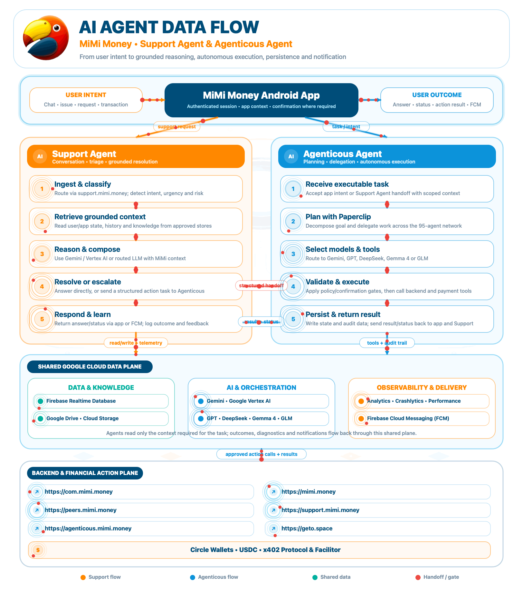
</p>

Static alternative: [MiMi Money AI agent data flow](Assets/MiMi-Money-AI-Agent-Data-Flow.png).

## System architecture

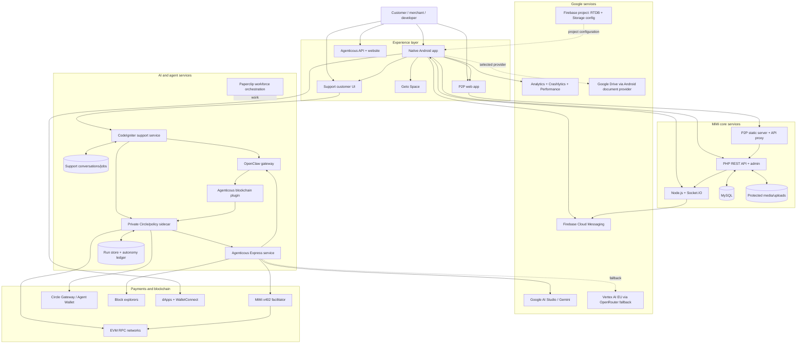

### Trust boundaries

| Boundary | Public side | Private or controlled side | Protection |
|---|---|---|---|
| Mobile to core API | Android client | PHP/MySQL service | HTTPS, session token, request validation |
| Mobile realtime | Socket.IO client | Realtime Node service | Shared backend token, user/session mapping, bounded events |
| Browser P2P | Browser assets | Server-side upstream proxy | Same-origin/CORS checks, body cap, API secret injection |
| Public paid API | x402 client | Agenticous report/run endpoint | Payment middleware, rate limits, input validation |
| Agenticous to model | Normalized explorer evidence | Google AI Studio/OpenRouter | HTTPS, fixed endpoints/providers, timeout, schema validation |
| Agent to privileged operations | OpenClaw plugin | Loopback-only sidecar | Bearer token, allowlists, spend policy, idempotency ledger |
| Resource server to settlement | Payment requirement + authorization | x402 facilitator and chain signer | Official x402 verification, compliance policy, per-chain clients |
| Public support chat | Public conversation token | Support database and OpenClaw | Tokenized conversation, bounded history, human handoff |

<p align="center">
  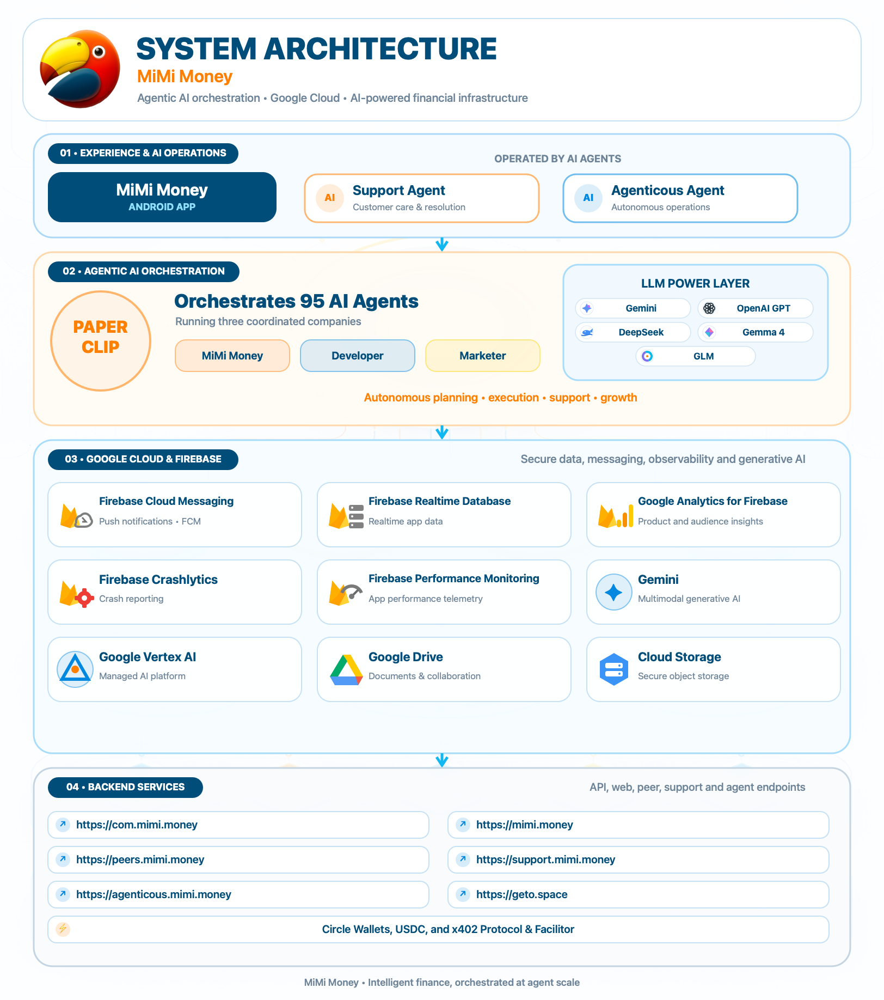
</p>

## End-to-end data flow

### Messaging and calls

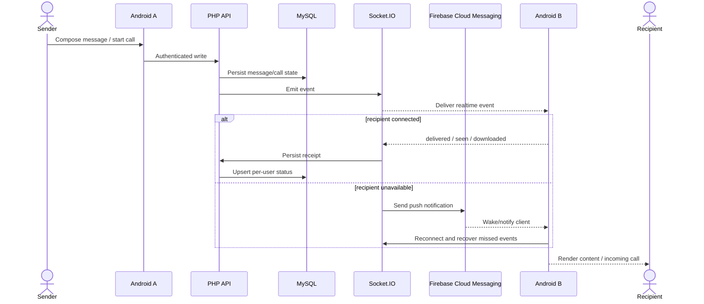

The call path uses Socket.IO for signaling and WebRTC for media. ICE servers are supplied by the server; configurable TURN credentials can be generated without exposing the TURN shared secret to the client.

### Paid Agenticous report

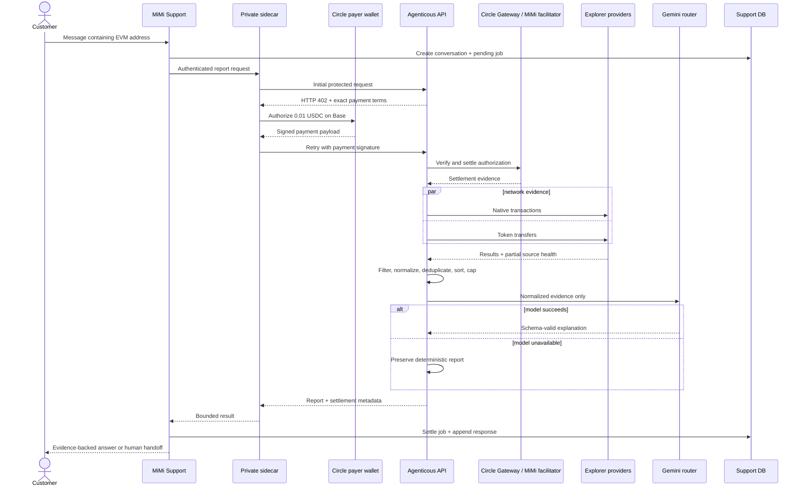

### Autonomous Agenticous run

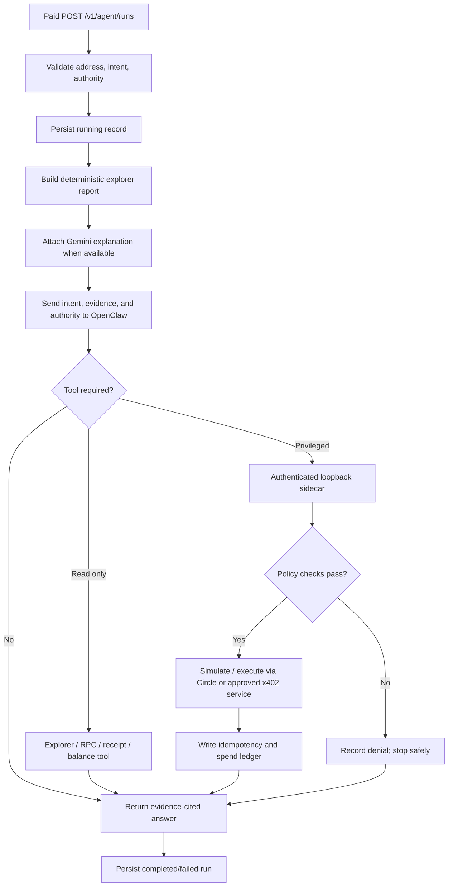

<p align="center">
  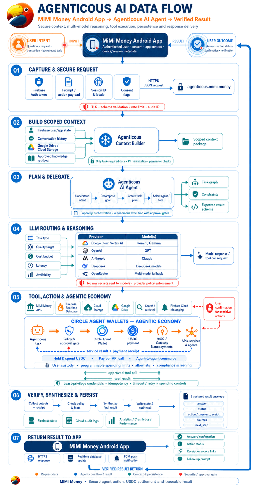
</p>

Static alternative: [Agenticous and Circle Agent Wallet data flow](Assets/MiMi-Money-Agenticous-AI-Data-Flow-Circle-Agent-Wallet.png).

## Backend services

### Service catalogue

| Service | Repository path | Runtime | Default/local bind | Production hostname | Responsibility |
|---|---|---|---|---|---|
| Core MiMi API/admin | `Backend-Services/Com-MiMi-Money/` | PHP 8.1+ / MySQL | `127.0.0.1:8080` with PHP dev server | `com.mimi.money` / `mimi.money` | Accounts, sessions, contacts, messaging, groups, calls, status, media, settings |
| Realtime service | `Backend-Services/Com-MiMi-Money/node_app/` | Node.js 18+ / Socket.IO | `:9001` by default | Behind MiMi infrastructure | Presence, message events, receipts, missed events, call signaling, push fallback |
| P2P gateway/UI | `Backend-Services/peers-p2p-trading/` | Dependency-free Node.js 18+ | `:8080` | `peers.mimi.money` | Static trading UI and protected upstream API proxy |
| Support application | `MiMi-Money-Support-Agent/` | PHP / CodeIgniter / MySQL | Web-server managed | `support.mimi.money` | Customer chat, support operations, AI conversations, human handoff |
| OpenClaw gateway | Deployment-managed | OpenClaw / Node | `127.0.0.1:18789` | Not directly public | Support and Agenticous model/tool orchestration |
| Agenticous API | `Agenticous-AI-Agent/` | TypeScript / Express | `127.0.0.1:4410` | `agenticous.mimi.money` | Paid reports, persisted agent runs, explorers, Gemini, OpenClaw |
| Support sidecar | `Agenticous-AI-Agent/integration/support-client/` | TypeScript / Express | `127.0.0.1:4411` | Not public | x402 purchasing, Circle tools, RPC reads, policy and spend ledger |
| x402 facilitator | `Backend-Services/x402-payments-facilitator/` | TypeScript / Express | `127.0.0.1:4402` | `x402.mimi.money` | Capability discovery, verify, settle, compliance, metering |
| Paperclip | `paperclip/` | TypeScript/Node/React/Postgres ecosystem | Deployment-specific | Deployment-specific | Multi-company AI workforce control plane |

### Core API and realtime service

The core API exposes both query-command and clean route forms for compatibility with the Android client. Major areas include registration, application settings, contacts, user profiles, blocking, calls, groups, message/media uploads, message statuses, backup state, and protected media retrieval.

MySQL schema groups include:

- administrators and application settings;
- users, sessions, labels, blocked users, and SMS-code compatibility;
- conversations, messages, images, audio, video, and documents;
- groups and group members;
- calls and user statuses;
- pending wallet-address messages; and
- per-user message status.

The Socket.IO server adds authenticated `/emit` and `/push` internal endpoints, `/health`, missed-message polling, presence, group and direct-message events, call routing, and ICE-server discovery.

### Agenticous public API

Base URL: `https://agenticous.mimi.money`

| Method | Endpoint | Payment | Purpose |
|---|---|---:|---|
| `GET` | `/` | No | Product website |
| `GET` | `/healthz` | No | Process and provider readiness |
| `GET` | `/v1/capabilities` | No | Price, wallet, network, model, and authority discovery |
| `POST` | `/v1/reports/transactions` | Yes | Seven-day wallet activity report |
| `POST` | `/v1/agent/runs` | Yes | Evidence-backed investigation or bounded operation |
| `GET` | `/v1/agent/runs/:id` | No | Retrieve a persisted run by UUID |

Example report request:

```json
{
  "address": "0x0000000000000000000000000000000000000001"
}
```

Example read-only agent request:

```json
{
  "address": "0x0000000000000000000000000000000000000001",
  "intent": "Investigate the recent failed transaction and explain what is known.",
  "authority": {
    "mode": "read-only",
    "maximumExternalSpendUsd": "0"
  }
}
```

An unpaid protected request returns HTTP `402` with x402 payment requirements. The payment middleware runs before the report cache, so cached work remains a paid resource.

### x402 facilitator API

Base URL: `https://x402.mimi.money`

| Method | Endpoint | Purpose |
|---|---|---|
| `GET` | `/healthz` | Process, network, signer, and compliance readiness |
| `GET` | `/supported` | Standard x402 capability discovery |
| `POST` | `/verify` | Verify a payment payload against seller requirements |
| `POST` | `/settle` | Submit and confirm an authorized payment |
| `GET` | `/v1/supported` | Versioned capability alias |
| `POST` | `/v1/verify` | Versioned verify alias |
| `POST` | `/v1/settle` | Versioned settle alias |
| `GET` | `/v1/networks` | Human-readable enabled networks |
| `GET` | `/v1/pricing` | UTC monthly settlement usage and pricing |

Configured network support includes Ethereum, Polygon, Monad, MegaETH, Base, Base Sepolia, Mezo, Arbitrum One, Arbitrum Sepolia, Celo, and Avalanche C-Chain. Operators can enable a subset with `EVM_NETWORKS`; each enabled chain gets its own public and wallet client to prevent accidental cross-chain RPC reuse.

The pricing meter allows the first 1,000 successful settlements per UTC month free and records `$0.001` per successful settlement after that. This is facilitator usage pricing, not the price of the protected resource.

## Google Cloud and Google products

<p align="center">
  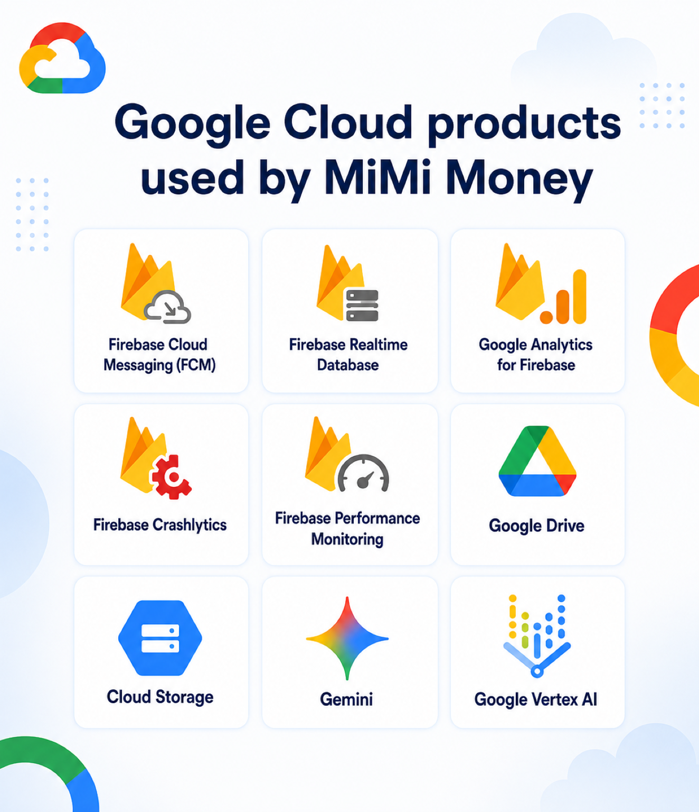
</p>

### Verified integrations

| Product | Where it appears | How MiMi Money uses it |
|---|---|---|
| **Gemini API / Google AI Studio** | `Agenticous-AI-Agent/src/gemini.ts` | Primary evidence-grounded explanation route for blockchain reports |
| **Google Vertex AI** | Agenticous OpenRouter configuration | Fallback route pinned to `google-vertex/eu`; provider fallback is disabled |
| **Firebase Cloud Messaging** | Android Firebase services; backend notification paths | Device tokens, global/app topics, message notices, and call/push fallback |
| **Google Analytics for Firebase** | Android `AppTelemetry` | Sanitized feature-open and operation-result events |
| **Firebase Crashlytics** | Android `AppTelemetry` | Sanitized non-fatal reports plus non-sensitive build metadata |
| **Firebase Performance Monitoring** | Android `AppTelemetry` | Explicit operation traces with defensive no-op fallback |
| **Firebase project configuration** | Android `google-services.json` | Declares the MiMi Firebase project, Realtime Database URL, and Storage bucket |
| **Google Drive** | Android Storage Access Framework backup | A user can select a Drive-backed document provider for Realm backup/restore without embedding Drive credentials |
| **Google Cloud Storage / Firebase Storage** | Firebase project configuration | A project bucket is configured; direct Android Storage SDK operations are not present in this checkout |

The current Android source does not directly instantiate the Firebase Realtime Database SDK. Realtime application messaging is implemented through the MiMi PHP/MySQL and Socket.IO services. The Firebase Realtime Database URL remains in the Firebase client configuration for project compatibility and future/other deployed consumers.

### Reliability and privacy behavior

- Telemetry initialization is isolated per SDK. Analytics, Crashlytics, or Performance can fail to initialize without preventing application startup.
- The telemetry facade prohibits wallet addresses, transaction hashes, amounts, messages, URLs, recovery phrases, private keys, PINs, and arbitrary server errors.
- FCM token acquisition and topic subscription happen through dedicated services rather than blocking the primary UI path.
- Gemini receives normalized explorer evidence and strict behavioral instructions, not wallet credentials.
- Model calls have bounded timeouts and deterministic fallback.
- Google Drive-style backup relies on the user-selected Android document provider and persisted URI permissions, avoiding an embedded service-account key.

<p align="center">
  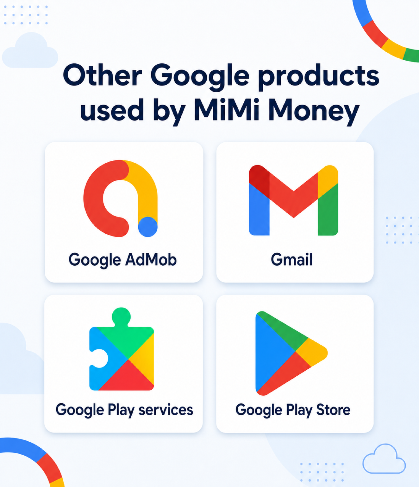
</p>

Additional Google ecosystem touchpoints include Google AdMob, Google Play services, and Google Play distribution. Gmail may be used operationally for project communication, but no Gmail API integration is implemented in the application source in this repository.

## How it was built and technology stack

MiMi Money was built incrementally around existing, battle-tested application boundaries. The native Android app owns device capabilities, local persistence, wallet signing, and the customer experience. A PHP/MySQL service owns durable application records and compatibility APIs; a smaller Node.js service handles the connections and fan-out patterns that suit realtime messaging and WebRTC signaling. Independent Node/TypeScript services were then added for P2P proxying, machine payments, blockchain evidence, and policy-controlled AI operations. Apache and systemd turn those processes into separately deployable and restartable production units.

That separation is intentional. Messaging can remain available when an AI provider is down; a deterministic wallet report can remain available when its natural-language summary fails; customer support can hand work to a person; and a model cannot bypass the sidecar that owns financial policy. Shared protocols—HTTPS/JSON, Socket.IO, EVM RPC, x402, and loopback bearer-authenticated service calls—connect the components without collapsing their security boundaries.

| Layer | Technologies |
|---|---|
| Android | Java, Kotlin, AndroidX, Material Components, Gradle, Realm, Retrofit/OkHttp, RxJava, WorkManager |
| Messaging and calls | PHP, MySQL/MariaDB, Node.js, Express, Socket.IO, WebRTC, FCM |
| Wallet and dApps | Web3j, BIP-39 credentials, EVM JSON-RPC, Reown WalletKit/WalletConnect, ZXing |
| Web experiences | HTML, CSS, vanilla JavaScript, CodeIgniter support UI |
| Agentic services | TypeScript, Node.js, Express, OpenClaw, Gemini, OpenRouter, JSON run/ledger persistence |
| Payments | x402 v2, `@x402/core`, `@x402/evm`, `@x402/express`, Circle x402 batching, USDC, Viem |
| Data | MySQL/MariaDB, Realm on device, protected filesystem media, bounded JSON ledgers |
| Operations | Apache, TLS/Let's Encrypt, systemd, loopback-bound Node services, environment files |
| Workforce orchestration | Paperclip server/UI, agent adapters, plugins, skills, company/project/issue model |

## Repository map

```text
.
├── Agenticous-AI-Agent/                 # Paid blockchain intelligence and operations
│   ├── src/                             # Express API, explorers, Gemini, OpenClaw, cache/runs
│   ├── public/                          # Agenticous product website
│   ├── integration/
│   │   ├── openclaw-plugin/             # Registered blockchain/Circle tools
│   │   ├── support-client/              # Private payment and policy sidecar
│   │   └── support/                     # PHP support adapter and job migration
│   ├── deployment/                      # systemd, Apache, install and upgrade scripts
│   └── test/                            # TypeScript unit tests
├── Assets/                              # Architecture, data-flow, product and roadmap visuals
├── Backend-Services/
│   ├── Com-MiMi-Money/                  # Core PHP/MySQL API and admin
│   │   ├── application/                 # Controllers and helpers
│   │   ├── install/dataBase.sql         # Schema-only database bootstrap
│   │   ├── node_app/                    # Socket.IO realtime and push service
│   │   └── uploads/                     # Empty tracked runtime directory structure
│   ├── peers-p2p-trading/               # P2P browser UI and upstream proxy
│   └── x402-payments-facilitator/       # Self-hosted x402 verifier/settler
├── MiMi-Money-Android-App/              # Native Android application
│   ├── app/src/main/                    # App source, resources and manifest
│   ├── app/src/test/                    # JVM unit tests
│   ├── scripts/                         # Translation and 16 KB alignment validation
│   └── gradle/                          # Gradle wrapper configuration
├── MiMi-Money-Support-Agent/            # Customer support and human-agent application
│   ├── application/                     # CodeIgniter app and AI support controller
│   ├── customer/                        # Customer-facing chat UI
│   ├── deployment/                      # SQL, Apache and OpenClaw service templates
│   └── openclaw/                        # Protected integration workspace
├── paperclip/                           # Multi-agent workforce orchestration source/bundles
└── Evidence/                            # Project evidence and expense/usage artifacts
```

`Evidence/` can contain financial or operational artifacts. Treat it as restricted project material even when individual files are tracked; do not copy its contents into public logs or documentation without review.

## Getting started

There is no single root process because MiMi Money is a multi-service system. Choose the component you are changing and follow its local README. The shortest useful local stack is the core API plus realtime service and an Android emulator/device.

### Prerequisites

- Git
- PHP 8.1+ with `mysqli`, `curl`, `openssl`, `gd`, `fileinfo`, and `mbstring`
- MySQL 5.7+/8.x or compatible MariaDB
- Node.js 18.18+ and npm
- JDK 17
- Android Studio, Android SDK 36.1, Build Tools 36.0.0
- Android NDK `21.4.7075529`
- Apache with rewrite/proxy/header modules for a production-like deployment

### Clone

```bash
git clone https://github.com/mimimoneydev/mimi.money.git
cd mimi.money
```

### Run the core API

```bash
cd Backend-Services/Com-MiMi-Money
cp .env.example .env
```

Create a local database and least-privileged user, then import the schema-only dump:

```bash
mysql -u "$DB_USER" -p "$DB_NAME" < install/dataBase.sql
```

Load the environment and start PHP:

```bash
set -a
. ./.env
set +a
php -S 127.0.0.1:8080 router.php
```

In another terminal, install and start the realtime service:

```bash
cd Backend-Services/Com-MiMi-Money/node_app
npm ci
npm start
```

The default Socket.IO health URL is `http://127.0.0.1:9001/health` unless `PORT` is overridden.

### Build the Android app

Create `MiMi-Money-Android-App/local.properties` with your Android SDK path:

```properties
sdk.dir=/absolute/path/to/Android/sdk
```

Keep private Android runtime values in the user-level Gradle properties file or the ignored local properties file:

```properties
BACKEND_SOCKET_TOKEN=replace_with_local_socket_token
WALLETCONNECT_PROJECT_ID=replace_with_reown_project_id
ADMOB_APP_ID=ca-app-pub-xxxxxxxxxxxxxxxx~yyyyyyyyyy
```

Build and test:

```bash
cd MiMi-Money-Android-App
./gradlew clean assembleDebug
./gradlew testDebugUnitTest
```

Install the debug APK:

```bash
adb install -r app/build/outputs/apk/debug/app-debug.apk
```

### Run the P2P interface

```bash
cd Backend-Services/peers-p2p-trading
cp .env.example .env
set -a
. ./.env
set +a
npm start
```

Open `http://localhost:8080`. No npm install is required for this service.

### Run Agenticous

```bash
cd Agenticous-AI-Agent
npm ci
cp .env.example .env
npm run build
npm start
```

Agenticous configuration is intentionally strict. Public origins and provider URLs must match approved HTTPS hosts; OpenClaw must use a loopback HTTP URL; the run store must stay under `/var/lib/agenticous` when configured.

For a complete support purchase or autonomous operation flow, also configure and start `integration/support-client/`, an OpenClaw gateway with the plugin, Circle wallet tooling, and the required database migrations. Follow [the Agenticous component guide](Agenticous-AI-Agent/README.md) before enabling any financial operation.

### Run the x402 facilitator

```bash
cd Backend-Services/x402-payments-facilitator
npm ci
cp .env.example .env
npm run build
npm start
```

Payment settlement requires a configured private key, the correct chain-specific RPC endpoints, native gas on every enabled network, and—under the default fail-closed policy—a working compliance webhook. A healthy process does not by itself mean settlement is ready.

## Configuration and secrets

Use the checked-in `.env.example` files as schemas, not as production values.

| Secret/configuration | Consumer | Safe location |
|---|---|---|
| Database credentials and app secret | Core PHP API | Local ignored `.env`; protected production environment file |
| Socket internal token | PHP, Node realtime, Android build config | Server environment + local Gradle property; never frontend source |
| Firebase service-account JSON | Backend push sender | Ignored server-only file outside the public web root |
| Firebase Android client config | Android | `google-services.json`; public client identifiers only |
| WalletConnect/Reown project ID | Android | User Gradle properties or ignored local properties |
| Android signing keystore/passwords | Android release | Protected keystore path and ignored keystore environment file |
| Gemini API key | Agenticous/OpenClaw | Root-owned environment file |
| OpenRouter API key | Agenticous/OpenClaw | Root-owned environment file |
| OpenClaw bearer token | Agenticous/support | Separate protected service environment files |
| x402 facilitator private key | Facilitator | Root-owned `/etc` environment file; never application directory |
| Circle wallet/session material | Sidecar tooling | Circle-managed/private service state |
| Agenticous sidecar token | Support + sidecar | Root-owned PHP/service configuration |
| P2P upstream API secret | P2P Node proxy | Server-only environment file |

Before committing, check staged content for private keys, phrases, bearer tokens, populated databases, user uploads, `.env` files, signing material, and financial exports.

## Build, test, and validation

Run the smallest relevant suite while developing and the full component suite before release.

### Agenticous

```bash
cd Agenticous-AI-Agent
npm ci
npm run typecheck
npm test
npm run build
```

### Agenticous support sidecar

```bash
cd Agenticous-AI-Agent/integration/support-client
npm ci
npm run typecheck
npm test
npm run build
```

### x402 facilitator

```bash
cd Backend-Services/x402-payments-facilitator
npm ci
npm run typecheck
npm test
npm run build
```

### P2P gateway

```bash
cd Backend-Services/peers-p2p-trading
npm test
```

### Core backend

```bash
cd Backend-Services/Com-MiMi-Money
find . -path './node_app/node_modules' -prune -o -name '*.php' -print0 | xargs -0 -n1 php -l
node --check node_app/app.js
node --check node_app/db.js
node --check node_app/socketHandler.js
node --check node_app/users.js
```

`node_app/test_features.js` is an integration helper requiring disposable users. Never point it at production.

### Android

```bash
cd MiMi-Money-Android-App
./gradlew testDebugUnitTest
./scripts/check_translations.sh
./gradlew assembleDebug bundleRelease -PunsignedReleaseBundle=true
./scripts/verify_16kb_alignment.sh
```

Also exercise registration, reconnect/missed messages, message receipts, calls, wallet restore, transaction approval, dApp rejection, backup/restore, support fallback, and notification permission behavior on supported Android versions.

## Security and reliability model

### Core principles

- **No secrets in browser bundles.** P2P credentials are injected only by the server proxy.
- **No wallet credentials in public services.** Agenticous receives public addresses and signed payment payloads, not buyer private keys.
- **Loopback for privilege.** OpenClaw and the Circle/policy sidecar are intended to bind only to localhost.
- **Payment before work.** Agenticous applies payment middleware before protected report/run handlers and before cache reuse.
- **Independent authorization.** Models can request tools; deterministic policy decides whether a privileged operation is allowed.
- **Idempotency and budgets.** The sidecar records operations and spend to prevent duplicate execution and enforce ceilings.
- **Bounded inputs and time.** Express body limits, HTTP timeouts, rate limits, output validation, and response caps reduce failure blast radius.
- **Partial-result honesty.** Explorer source health accompanies evidence, and model failure does not erase deterministic results.
- **Safe telemetry.** A dedicated sanitizer prevents financial, wallet, message, and credential data from reaching analytics/crash metadata.
- **Human fallback.** Support automation escalates ambiguous or failed work instead of inventing a resolution.
- **Protected runtime files.** Production environment and mutable data live outside public application roots with dedicated service users.

### Agenticous AI agent execution

<p align="center">
  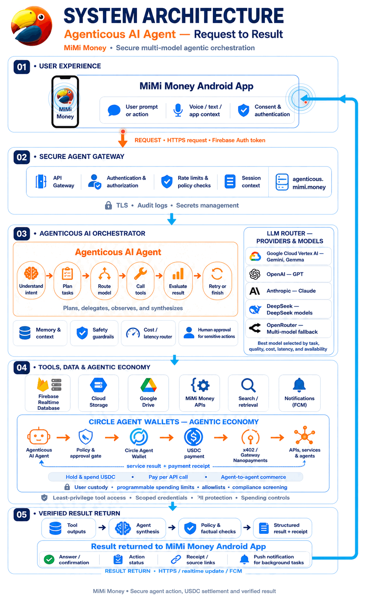
</p>

Static alternative: [Agenticous and Circle Agent Wallet architecture](Assets/MiMi-Money-Agenticous-AI-Architecture-Circle-Agent-Wallet.png).

### Production hardening checklist

- Terminate TLS at Apache or another reviewed reverse proxy and redirect HTTP to HTTPS.
- Keep Node services on loopback unless a service is explicitly designed to be public.
- Run each privileged service as its own unprivileged system account.
- Use unique, high-entropy bearer tokens for every internal boundary.
- Use dedicated authenticated RPC endpoints and verify chain IDs.
- Fund facilitator wallets only with the minimum native gas required for enabled networks.
- Keep x402 compliance fail-closed until the screening integration is healthy.
- Start autonomous financial tools disabled; introduce narrow host, chain, asset, contract, and recipient allowlists.
- Use small per-operation and rolling spend ceilings.
- Preserve settlement hashes, request IDs, agent run IDs, and idempotency keys for audit.
- Back up MySQL, support tables, protected uploads, run storage, and autonomy ledgers outside Git.
- Restrict the legacy admin and install surfaces before public exposure.
- Rotate credentials on suspected exposure; do not rely on deletion from Git history.
- Keep Firebase service accounts server-side and distinguish them from public Android Firebase configuration.
- Review Android dependency, SDK target, signing, obfuscation, and 16 KB alignment results before publishing.

## Operations and deployment

Production templates use Apache for TLS and reverse proxying, and systemd for service supervision. The intended topology keeps public traffic on ports 80/443 while privileged Node processes bind to fixed loopback ports.

| Unit/template | Purpose | Notable hardening |
|---|---|---|
| `agenticous.service` | Public Agenticous backend behind Apache | Dedicated user, loopback bind, run-store access, restart policy |
| `mimi-support-agenticous.service` | Private support/payment sidecar | Dedicated user, protected environment, ledger-only mutable path |
| `mimi-x402.service` | x402 facilitator | Dedicated user, protected key/config, metering path, restart policy |
| `openclaw-gateway.service` | OpenClaw support gateway | Dedicated user, protected home/config, loopback port |
| `peers-p2p.service` | P2P static/proxy service | Server-side upstream secret, reverse-proxied public UI |

Health checks should distinguish process liveness from dependency readiness. In particular:

- Agenticous may be live while Gemini, OpenRouter, or OpenClaw is unconfigured; deterministic reports can still function if payment and explorers are available.
- The facilitator may be live while compliance is unconfigured or signer wallets lack gas; settlement will remain unavailable.
- FCM or telemetry failure should not crash Android startup or core messaging.
- A single explorer failure should produce partial source health, not fail the entire wallet report.

Recommended observability correlation fields are HTTP request ID, conversation ID, Agenticous job ID, agent run UUID, x402 transaction hash, network/chain ID, and idempotency key. Never use a private key, phrase, raw access token, full message body, or wallet balance as a log correlation field.

## Roadmap

<p align="center">
  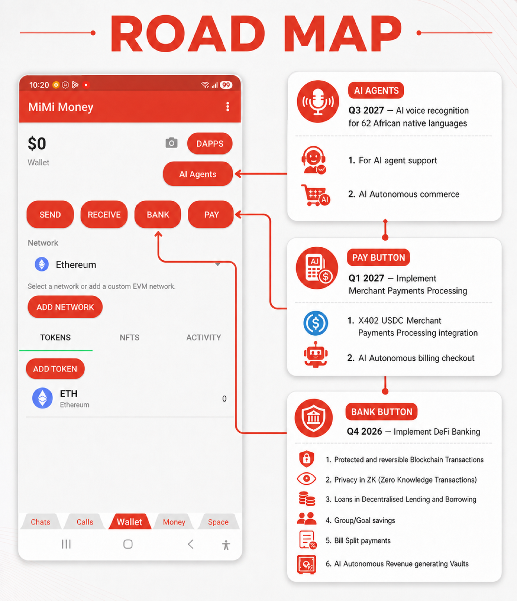
</p>

The roadmap visual communicates product direction. Treat deployed code, health/capability endpoints, and component documentation as the source of truth for currently available behavior.

## Known boundaries

- This monorepo is several deployable systems, not a single `npm start` application.
- Public explorer data can be delayed, incomplete, or temporarily unavailable; Agenticous is an aggregator, not a blockchain node or canonical indexer.
- AI explanations are supplemental. Explorer links, RPC receipts, and settlement hashes are the verifiable evidence.
- The Android wallet is self-custodial; losing unbacked-up recovery material can make funds unrecoverable.
- The Google Drive backup path uses Android’s document-provider interface. Availability depends on the provider selected and configured on the device.
- Firebase Realtime Database and Cloud Storage are declared in project configuration, but direct Android SDK usage is not implemented in the checked-in application code.
- The P2P repository is a frontend/proxy; authoritative market and order behavior belongs to the configured upstream API.
- The support application contains an established third-party Chatbull/CodeIgniter base plus MiMi-specific AI integration. Review legacy authentication and dependencies before a new public deployment.
- The Paperclip directory contains the orchestration code/bundles, not the live 95-agent deployment database or credentials.
- x402 chain support does not imply that every token is compatible. Validate token address, decimals, EIP-712 domain, transfer mechanism, and issuer/liquidity risk.
- Autonomous financial operations are configuration-gated and should remain disabled until policy, allowlists, simulation, monitoring, and incident response have been reviewed.

## Documentation index

- [Android application guide](MiMi-Money-Android-App/README.md)
- [Core PHP/MySQL backend guide](Backend-Services/Com-MiMi-Money/README.md)
- [P2P trading guide](Backend-Services/peers-p2p-trading/README.md)
- [x402 facilitator guide](Backend-Services/x402-payments-facilitator/README.md)
- [Agenticous architecture, API, policy, and deployment guide](Agenticous-AI-Agent/README.md)
- [Static system architecture](Assets/MiMi-Money-System-Architecture.png)
- [Static AI-agent data flow](Assets/MiMi-Money-AI-Agent-Data-Flow.png)
- [Static Agenticous architecture](Assets/MiMi-Money-Agenticous-AI-Architecture-Circle-Agent-Wallet.png)
- [Static Agenticous data flow](Assets/MiMi-Money-Agenticous-AI-Data-Flow-Circle-Agent-Wallet.png)

## Contributing

1. Create a focused branch and keep changes inside the relevant component.
2. Read that component’s README and deployment constraints before editing.
3. Preserve backwards compatibility for public API routes, Socket.IO events, Android data models, and payment schemas unless a migration is included.
4. Add or update tests for behavior changes.
5. Run the component validation commands above.
6. Never commit real environment files, credentials, signing artifacts, wallet material, populated databases, user uploads, or generated build output.
7. Document new services, ports, environment variables, trust boundaries, payment behavior, and Google integrations in this root README and the component README.

Financial, authentication, encryption, wallet, payment, and agent-authority changes deserve an explicit security review. Prefer fail-closed behavior for privileged operations and graceful degradation for optional intelligence, telemetry, and third-party data.

## License

No repository-wide `LICENSE` file is present inhere. Do not assume permission to copy, redistribute, or operate the complete system beyond the rights granted by the project owners and the licenses of individual third-party dependencies or bundled components.

---

<div align="center">

**MiMi Money — communication, financial access, and intelligent operations in one connected platform.**

[mimi.money](https://mimi.money) · [GitHub](https://github.com/mimimoneydev/mimi.money)

</div>
